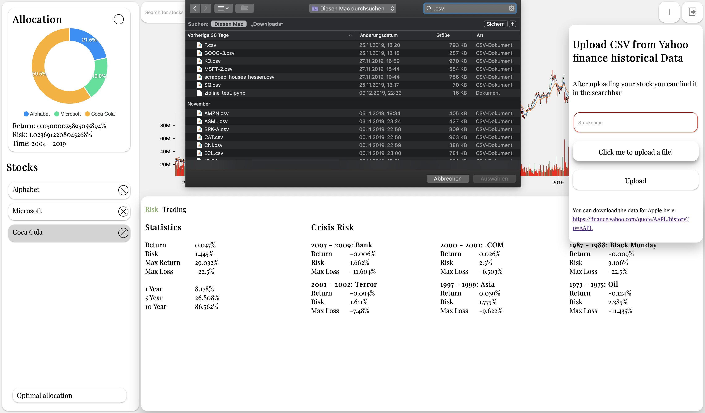
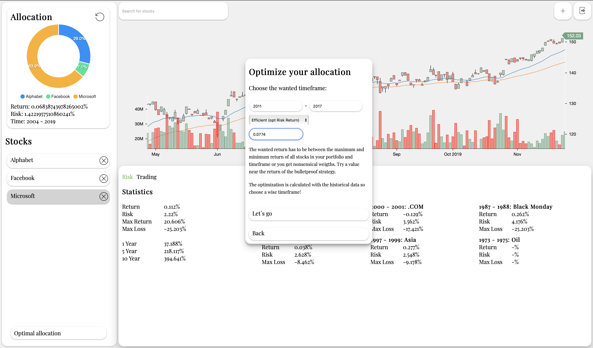
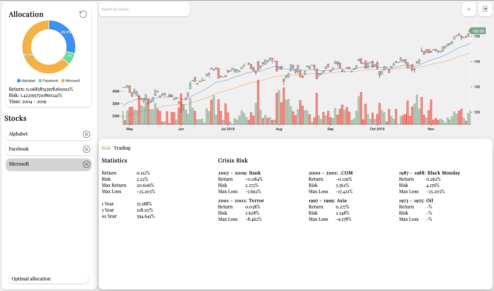

# Portfolio optimizer

This app is build to learn more about portfolio theory.
The stuff you learn in university is fine but putting it to work is much cooler.
You can download historical data from yahoo finance and upload it to the app.
After your upload you can search in your stocks via the searchbar and build your Portfolio.
At the end you choose your optmization (min risk or optimal risk return) and timeframe and voila there are your optimal portfolio weights.
You can also look at the performance of your portfolio in important crises and compare your portfolio with stocks.

### 1. Upload a csv of your stock
If you look closely you notice that the current data (Coca Cola stock) shown in the downer right corner shows a return of 0.047 and a risk of 1.44 and the weighted portfolio in the upper left shows a return of 0.05 and a risk of 1.023. So the Portfolio outperforms Coca Cola.


### 2. Choose an optimization
First try min risk to get a feeling for setting the wanted return in the optimal risk return strategy.


### 3. Look at your Portfolio



## Getting Started

These instructions will get you a copy of the project up and running on your local machine for demo purposes.

For an easy start use docker.

```
docker-compose up --build
```

## Authors

* **Julian Streibel** [julianstreibel](https://github.com/julianstreibl)
